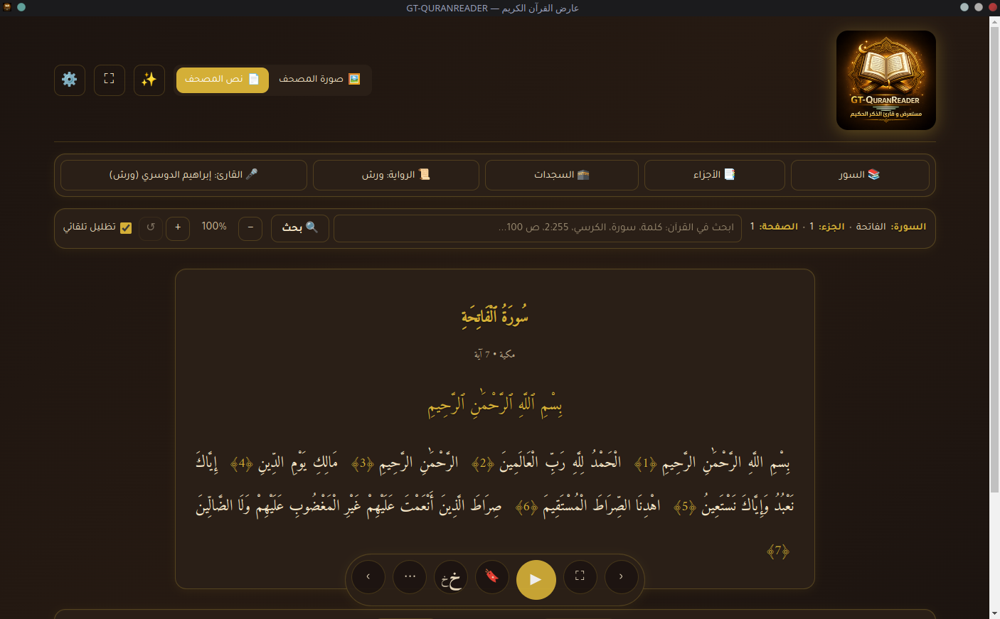
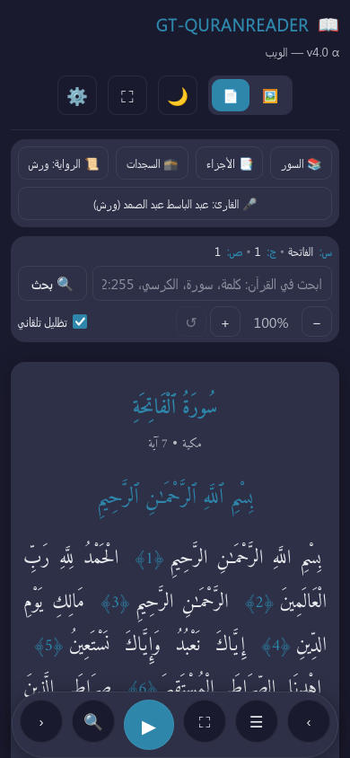
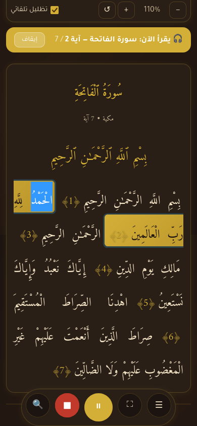
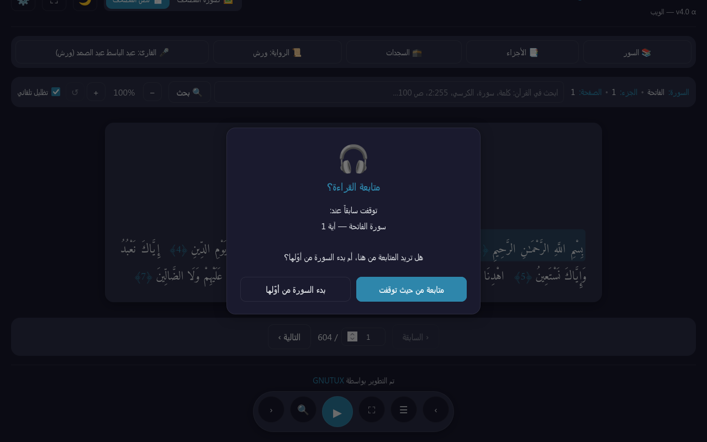

<div align="center">

# 📖 GT-QURANREADER

**عارض القرآن الكريم — نسخة موحَّدة لسطح المكتب والويب والموبايل**


-orange)


تطبيق واحد بكود واحد، يعمل على **خمس صيغ توزيع**: AppImage + DEB + RPM + Flatpak لـ Linux، و APK لـ Android — عبر `npm workspaces` ومكتبات React/TypeScript، مع PWA على المتصفح و iOS عبر Capacitor.

[المزايا](#-المزايا-الرئيسية) • [التشغيل](#-التشغيل-السريع) • [البنية](#-البنية-المعمارية) • [التحزيم](#-التحزيم-والنشر) • [الترخيص](#-الترخيص)

</div>

---

## 📸 لقطات

<div align="center">

| سطح المكتب — وضع النص | الهاتف |
|:---:|:---:|
|  |  |

| أثناء التشغيل (شريط عائم + إيقاف تام) | حوار متابعة القراءة |
|:---:|:---:|
|  |  |

</div>

---

## ✨ المزايا الرئيسية

### 📜 4 روايات معتمدة عند أهل السنة والجماعة
- **ورش عن نافع** (الافتراضية — المعتمدة في المغرب العربي)
- حفص عن عاصم (الأكثر انتشاراً عالمياً)
- قالون عن نافع
- الدوري عن أبي عمرو

النص لكل رواية يُجلب من `api.alquran.cloud` ويُكاش في `IndexedDB` (Web) أو ملفات في `userData/data/text/` (Desktop).

### 🎤 13+ قارئاً عبر مصدرين
- **`everyayah.com`** — صوت لكل آية على حدة → يدعم **تظليل آية بآية** متزامن مع القراءة.
- **`mp3quran.net`** — سور كاملة كمصدر احتياطي.

أبرز القراء: مشاري العفاسي، الحصري، المنشاوي، عبد الباسط (حفص)، الغامدي، الشاطري، ياسر الدوسري، محمد أيوب، **إبراهيم الدوسري (ورش — الافتراضي)**، ياسين الجزائري (ورش)، إلخ.

### 🎧 التظليل المتزامن مع القراءة
- **نقرة واحدة** على آية → تظليل بصري.
- **نقرتان** → تشغيل صوتها + تتابع تلقائي للآيات.
- الـ Banner يعرض دائماً: `سورة X — آية Y / Z`.
- تتابع الصفحات تلقائي عبر الـ Workbox/preload (فجوة <200ms).
- البسملة تُدرج تلقائياً قبل كل سورة (عدا الفاتحة والتوبة).

### 🔍 بحث ذكي يفهم العربية كاملة
| الإدخال | المُخرج |
|---|---|
| `الرحمن` / `الرحمان` / `الرحمٰن` | 157 نتيجة (تطبيع كامل للهمزات/التشكيل/التطويل) |
| `2:255` | البقرة آية 255 (الكرسي) → القفز للصفحة 42 |
| `الكرسي` / `قلب القرآن` | كنى الآيات والسور الشهيرة |
| `ص 100` / `جزء 30` | مرجع صفحة/جزء |
| `يس` / `الفاتحة` / أسماء بالإنجليزية | بحث في أسماء السور |

### 🎨 6 خطوط قرآنية + 5 سمات
- خطوط: عثماني (مصحف المدينة)، أميري، أميري ملوّن، ArbFONTS، خط النظام (Naskh)، مسطر بسيط.
- سمات: **ذهبي 🏺 (الافتراضية)** / ليلي 🌙 / نهاري ☀️ / سيبيا 📜 / تلقائي (يتبع النظام).

### 💾 العمل offline (PWA + Desktop)
- **Web**: `vite-plugin-pwa` + Workbox مع 5 استراتيجيات (precache + CacheFirst للصور/الصوت + StaleWhileRevalidate للـ API).
- **Desktop**: تنزيل النص/الصوت/الصور إلى `userData/data/` مع شاشة إدارة تنزيل (مع تقدّم + إلغاء).
- IndexedDB لتخزين النصوص الكبيرة في Web.

### 🖥️ تصميم متجاوب — شريط عائم — ملء الشاشة
- يعمل من 360px (هاتف) إلى 4K.
- **شريط عائم** بزر إيقاف مؤقت ⏸ + زر إيقاف تام ■ منفصلين.
- **وضع ملء الشاشة** ⛶ يُخفي كل الأدوات؛ الشريط العائم يختفي بعد 3 ثوان من الخمول ويعود عند الحركة.
- **swipe** للتنقل بين الصفحات على الموبايل.
- على الهاتف أثناء القراءة: أزرار التنقل بين الصفحات تُخفى تلقائياً (المتابعة تكون أوتوماتيكية).

### 💡 استعادة موضع القراءة عبر الجلسات
- آخر آية تم الوقوف عندها تُحفظ في `localStorage` تلقائياً.
- عند فتح التطبيق لاحقاً: الآية مظللة في موضعها.
- ضغط ▶ يُظهر حواراً مخصصاً: **"متابعة من حيث توقفت / بدء السورة من أوّلها"**.

---

## 🚀 التشغيل السريع

```bash
# المتطلبات: Node.js ≥ 20, npm ≥ 10
git clone https://github.com/SalehGNUTUX/GT-QURANREADER.git
cd GT-QURANREADER
npm install

# الويب (PWA) — http://localhost:5174
npm run dev:web

# سطح المكتب (Electron + Vite معاً)
npm run dev:desktop
```

### بناء الإنتاج

```bash
npm run build              # يبني Desktop + Web معاً
npm run build:web          # PWA فقط → apps/web/dist/
npm run build:desktop      # Desktop فقط
npm --workspace=apps/desktop run build:linux  # AppImage + .deb
```

### الموبايل (Capacitor)

```bash
cd apps/web
npm run cap:android:add    # أول مرة (يحتاج Android SDK + JDK 17)
npm run cap:android:run    # build + sync + run
npm run cap:ios:add        # يحتاج macOS + Xcode
```

---

## 🏗️ البنية المعمارية

```
GT-QURANREADER/                        ← Monorepo (npm workspaces)
│
├── packages/
│   ├── core/                          ← @gt-quranreader/core (منطق بحت)
│   │   ├── data/                      (114 سورة، 30 جزء، 15 سجدة، 4 روايات)
│   │   ├── search/                    (تطبيع عربي + محرك بحث متعدد المستويات)
│   │   ├── api/                       (alquran.cloud + everyayah + mp3quran)
│   │   ├── audio/                     (VersePlayer + reciter catalog)
│   │   ├── storage/                   (تفضيلات + schema versioning)
│   │   └── types.ts
│   │
│   └── ui/                            ← @gt-quranreader/ui (React مشترك)
│       └── src/
│           ├── components/            (reader/controls/search/modals/settings)
│           ├── hooks/                 (usePreferences/useSearch/useSwipe/useFullscreen)
│           ├── fonts/                 (6 خطوط + catalog)
│           └── styles/global.css
│
├── apps/
│   ├── desktop/                       ← @gt-quranreader/desktop (Electron)
│   │   ├── electron/                  (main + preload + IPC handlers)
│   │   └── src/                       (Platform hooks: useQuranData/useVersePlayer)
│   │
│   └── web/                           ← @gt-quranreader/web (PWA + Capacitor)
│       ├── capacitor.config.ts        (Android + iOS)
│       └── src/                       (Platform hooks: IndexedDB-aware)
│
└── _legacy/                           ← النسخ القديمة v3.x (مرجع فقط)
```

### مبدأ المشاركة:
- **`packages/core/`**: لا يستورد أي شيء من React/DOM/Node. منطق بحت.
- **`packages/ui/`**: React components + hooks مستقلة عن البيئة (لا يستورد من Electron مباشرة).
- **`apps/desktop/`** و **`apps/web/`**: قشور رفيعة، تحقن خصوصيات البيئة عبر **prop injection**:
  - `<SettingsModal DownloadManager={...} />` — كل app يحقن DownloadManager الخاص به.
  - `<ImagePage resolveLocalPath={...} />` — Desktop يحقن، Web يتجاهل.

النتيجة: **>90% من الكود مشترك فعلياً** بين المنصات الأربع.

### راجع `CLAUDE.md` للتفاصيل التقنية الكاملة (للمطورين الذين سيعملون على الكود).

---

## 📦 التحزيم والنشر

كل صيغ التوزيع تُبنى عبر سكريبت واحد: **`scripts/build-packages.sh`**. الناتج يذهب إلى `release/` في جذر المشروع.

```bash
bash scripts/build-packages.sh             # كل شيء = Linux + Android
bash scripts/build-packages.sh linux       # AppImage + DEB + RPM
bash scripts/build-packages.sh appimage    # AppImage فقط
bash scripts/build-packages.sh deb         # DEB فقط
bash scripts/build-packages.sh rpm         # RPM (من DEB عبر alien)
bash scripts/build-packages.sh flatpak     # Flatpak (يستخرج AppImage موجود ويغلّفه)
bash scripts/build-packages.sh apk         # APK أندرويد (gradle)
bash scripts/build-packages.sh web         # PWA فقط (apps/web/dist/)
bash scripts/build-packages.sh check-deps  # فحص المتطلبات بدون تثبيت
```

السكريبت يكتشف التوزيعة تلقائياً (apt/dnf/pacman/zypper) ويعرض تثبيت المتطلبات المفقودة. لـ APK يلزم `ANDROID_HOME` (عادةً `~/Android/Sdk`) و JDK 17. لـ Flatpak يلزم `flatpak-builder` و `appstreamcli`.

### الحزم الجاهزة (v4.0.0)

| الصيغة | الحجم | للتوزيعات |
|---|---|---|
| `GT-QURANREADER-4.0.0-x86_64.AppImage` | 109 MB | كل توزيعات Linux (محمول) |
| `GT-QURANREADER-4.0.0-amd64.deb` | 77 MB | Debian / Ubuntu / Mint |
| `GT-QURANREADER-4.0.0-x86_64.rpm` | 107 MB | Fedora / RHEL / openSUSE |
| `GT-QURANREADER-4.0.0.flatpak` | 78 MB | كل توزيعات Linux |
| `GT-QURANREADER-4.0.0-debug.apk` | 4.6 MB | Android (للاختبار) |
| `GT-QURANREADER-4.0.0-unsigned.apk` | 4.4 MB | Android (يلزم توقيعه للنشر) |

### Web (PWA) → GitHub Pages
```bash
npm run build:web
# انشر apps/web/dist/ على فرع gh-pages
```

### iOS (Capacitor) — يلزم macOS + Xcode
```bash
cd apps/web && npm run cap:ios:add && npx cap open ios
```

---

## 🌐 مصادر البيانات

| النوع | المصدر | الترخيص |
|---|---|---|
| نص الروايات الأربع | [api.alquran.cloud](https://alquran.cloud/api) | حر |
| صور الصفحات (604) | [SalehGNUTUX/Quran-PNG](https://github.com/SalehGNUTUX/Quran-PNG) | حر + 3 مصادر بديلة |
| صوت لكل آية | [everyayah.com](https://everyayah.com/) | حر |
| صوت لسور كاملة | [mp3quran.net](https://mp3quran.net/) | حر |
| ملف البسملة العام | `everyayah.com/data/bismillah.mp3` | حر |

---

## 📋 الميزات الأخرى

- ✅ Schema versioning تلقائي — ترقية الإعدادات بدون يدوية.
- ✅ زر "إعادة الإعدادات الافتراضية" يدوي في الإعدادات.
- ✅ Hardware back button على Android (يغلق modals → بحث → صوت → خروج).
- ✅ Status bar داكن على Android (Capacitor StatusBar API).
- ✅ تكامل HTML5 Fullscreen API (مع Esc للخروج).
- ✅ اختصارات لوحة المفاتيح: ← → للتنقل، Space للتشغيل، Esc للإغلاق.
- ✅ Arabic-Indic digits (٢٥٥) ⇄ Latin (255) في البحث.

---

## 🤝 المساهمة

نرحب بالمساهمات. اطّلع على [`CONTRIBUTING.md`](CONTRIBUTING.md) للتفاصيل.

## 📝 سجل التغييرات

[`CHANGELOG.md`](CHANGELOG.md)

## ⚖️ الترخيص

ترخيص مزدوج:
- **سطح المكتب + النواة المشتركة** (`apps/desktop/`, `packages/core/`, `packages/ui/`): **GNU GPL v3.0 أو أحدث** — راجع [`LICENSE`](LICENSE).
- **نسخة الويب/PWA** (`apps/web/`): **GNU AGPL v3.0 أو أحدث** — راجع [`apps/web/LICENSE`](apps/web/LICENSE).

الـ AGPL تضمن أن أي خادم يستضيف هذه النسخة يجب أن يجعل الكود المصدري متاحاً للمستخدمين عبر الشبكة (network copyleft).

---

<div align="center">

**"وَنَزَّلْنَا عَلَيْكَ ٱلْكِتَٰبَ تِبْيَٰنًۭا لِّكُلِّ شَىْءٍۢ"** — النحل 89

🤲 _اللهم اجعل هذا العمل صدقة جارية_

تم التطوير بواسطة [SalehGNUTUX](https://github.com/SalehGNUTUX)

</div>
